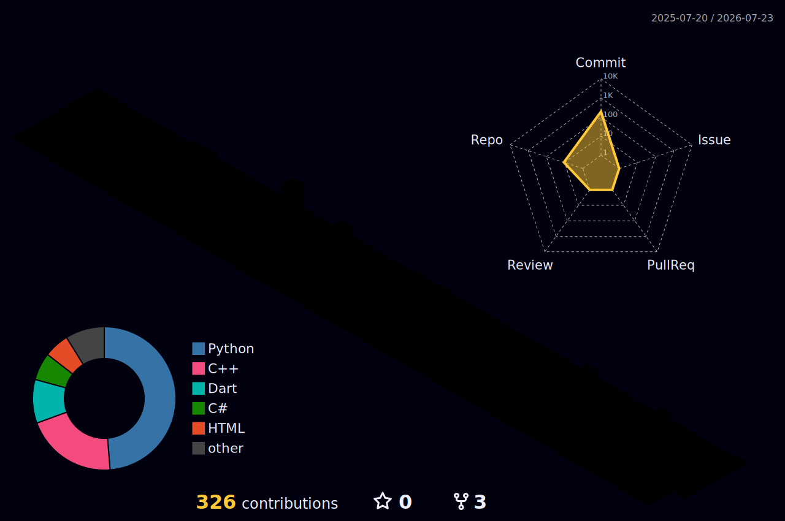

# Hi I'm Hyunmin Song, AI & Game developer. Nice to meet you!

### Programming Langauages

### Pimary Engines

### Etc

### Baekjoon Solved.ac Card

### 🎮 Career & Projects
경희대학교 공간빅데이터 연구실 학부연구생 (Geospatial Bigdata Lab Intern)

2024.2 ~ 2025.3

- 학부 연구 인턴으로 참여하여, Python, R 언어를 이용한 데이터 전처리 및 분석 시행
- QGIS, ArcPro를 사용하여 지역 격차와 관련한 공간데이터 분석 시행 및 지도 시각화
- KIC 우수 등재 논문 발간, 학회 발표 참여

경희대학교 해외 전공 연수 (서조지아 주립 대학 하계 전공 연수) (2024.7)

지리학과 공간정보학회 Mapsee(맵씨) 부학회장 (2024.3 ~ 2025.2)

### 🏆 Awards & Activities
- 경희대학교 예술적인 소프트웨어 실감미디어 부문 출품 (2025)
- 경희대학교 SW 페스티벌 출품 (2025)
- 경희대학교 SW 창업경진대회 출품 및 포스터 전시 (2025)
- KHU 가을 프로그래밍 경시대회 장려상 (ICPC 예선) (2025)
- 경희꿈도전장학 창업 부문 최종 선발 및 후속 지원 (2024)
- 지리 SDGs 학술제 우수상 (2024)
- 공간정보학회 추계학술대회 포스터 부문 수상 (2024)
- 제3회 공간분석연구 포스터 공모전 수상 (2024)
- 대한지리학회 우수 논문상 수상 (2023)

<!--
**Ggulbogpig/Ggulbogpig** is a ✨ _special_ ✨ repository because its `README.md` (this file) appears on your GitHub profile.

Here are some ideas to get you started:

- 🔭 I’m currently working on ...
- 🌱 I’m currently learning ...
- 👯 I’m looking to collaborate on ...
- 🤔 I’m looking for help with ...
- 💬 Ask me about ...
- 📫 How to reach me: ...
- 😄 Pronouns: ...
- ⚡ Fun fact: ...
-->
